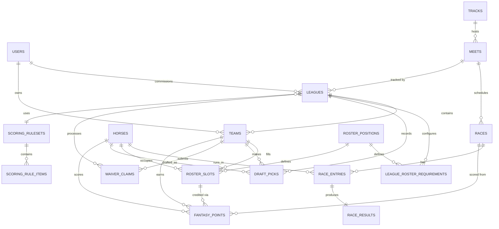

# Fantasy Quarter Horse Stable — Database Schema

This is the blueprint for how a `User` links to the `Horses` they draft: real-world
racing data (horses, tracks, meets, races, results) is kept separate from fantasy
data (leagues, teams, rosters, scoring), joined through a scoring engine. That
split lets one race-chart ingestion pipeline feed any number of leagues/seasons.

SQL lives in [`db/migrations/0001_initial_schema.sql`](../db/migrations/0001_initial_schema.sql).
Reference/seed data (roster positions, default scoring ruleset) lives in
[`db/seed/0001_default_reference_data.sql`](../db/seed/0001_default_reference_data.sql).

## Entity relationship diagram

## How a User links to their drafted Horses

`users` → `teams` (one team per user per league) → `roster_slots` (one row per
physical slot on the team, e.g. "Bench #2") → `horses` (nullable FK, set when
the slot is filled). A slot is filled three ways, recorded on the slot itself:

- **Draft**: a `draft_picks` row is written (league + team + horse + pick
  number), and the corresponding `roster_slots.horse_id` is set with
  `acquired_via = 'draft'`.
- **Waiver wire**: a `waiver_claims` row moves through
  `pending → approved/rejected`; an approved claim updates the slot the same
  way with `acquired_via = 'waiver'`, optionally vacating another slot via
  `drop_horse_id`.
- **Trade**: not yet modeled as its own table — `acquired_via = 'trade'` is
  reserved on `roster_slots` for when trade support is built.

A partial unique index (`idx_roster_slots_one_owner_per_league`) guarantees a
horse can't be rostered by two teams in the same league at once.

## Roster positions

`roster_positions` is a fixed reference table seeded with the five slot types
from the product pitch (`SPRINT_220_350`, `CLASSIC_400_440`, `DISTANCE_870`,
`TWO_YO`, `THREE_YO_UP`, plus `BENCH`). These are fantasy-defined slots, not
exclusive horse attributes — a horse can be draft-eligible for more than one —
so eligibility is a draft-time/app-level decision, not a schema constraint.
Each league declares how many of each slot it carries via
`league_roster_requirements` (e.g. 2× `SPRINT_220_350`, 1× `DISTANCE_870`,
3× `BENCH`), so roster shape is configurable per league rather than hardcoded.

## Scoring engine

`scoring_rulesets` + `scoring_rule_items` hold a reusable, versionable points
table (see the seeded "League Default" ruleset for the pitch's numbers: Win
+25, Place +15, Show +10, +1/pt of Speed Index over 95, +15 for a track
record, 1.5× multiplier on stakes races). A league picks one ruleset via
`leagues.scoring_ruleset_id`.

After a race chart is ingested into `races` / `race_entries` / `race_results`,
the scoring engine worker joins each result against every league whose teams
have that horse rostered (via `roster_slots`), applies that league's
`scoring_ruleset_id`, and writes one row per (team, horse, race) into
`fantasy_points` — with the line-item math kept in `breakdown` (jsonb) for
display/audit without recomputing it from the ruleset later.

## Deliberate simplifications (MVP)

- Enumerated values (`horses.sex`, `leagues.status`, `scoring_rule_items.rule_type`,
  ...) use `CHECK` constraints instead of native Postgres `ENUM` types — new
  race grades/statuses show up often in scraped chart data, and altering a
  `CHECK` is a one-line migration where altering an `ENUM` needs more ceremony.
- Trades aren't a modeled entity yet (`roster_slots.acquired_via` reserves the
  value); add a `trades` table when trade support is built.
- No `payouts`/`prizes` table yet — that belongs with the paid-entry season
  tournament structure, not the core roster/scoring schema.
